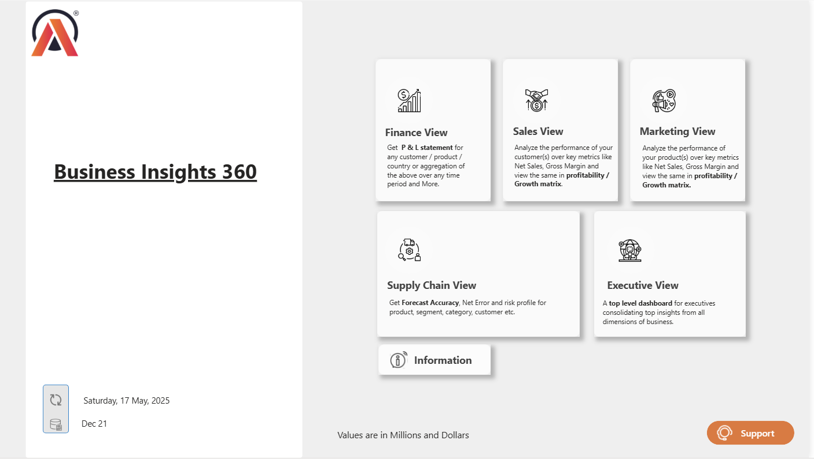
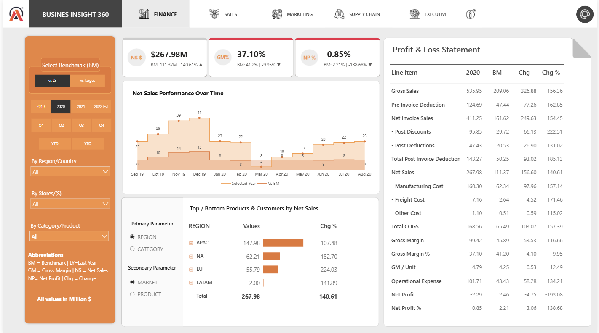
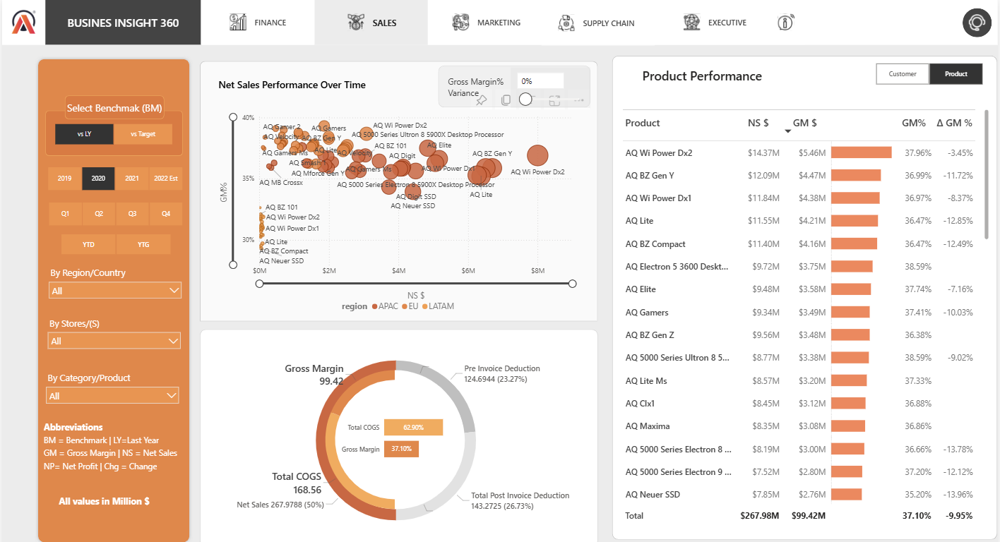
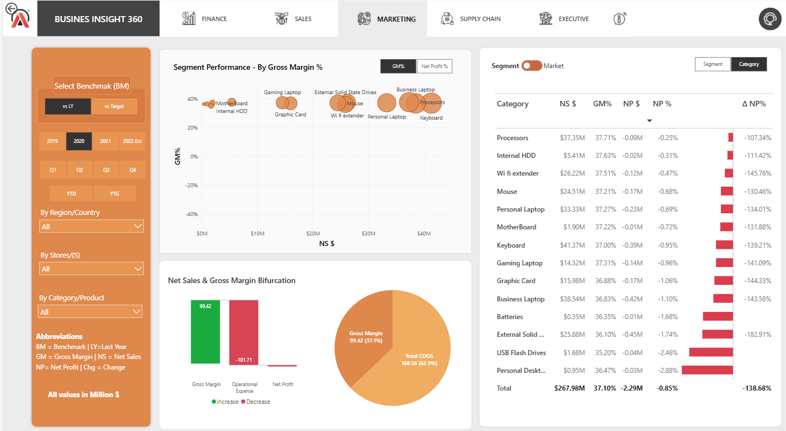
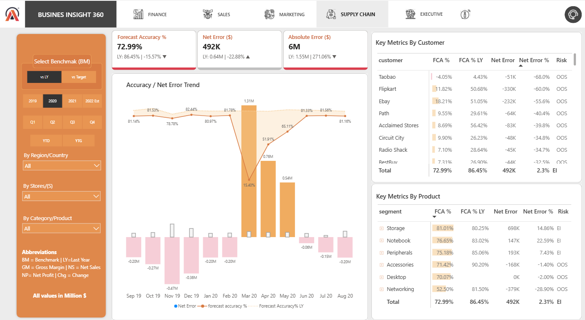
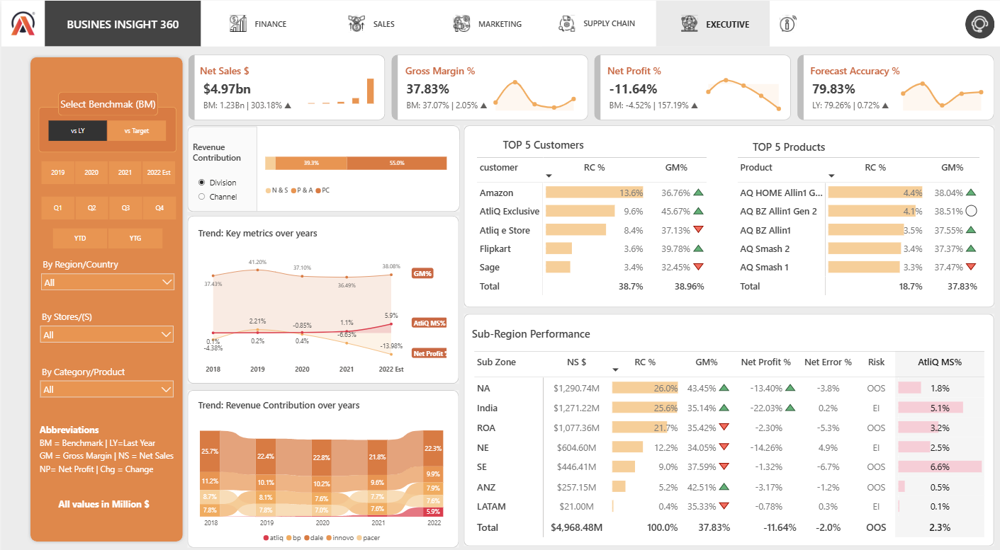
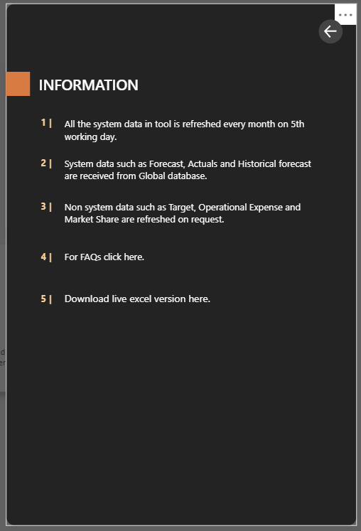

# Business Insights 360 – Power BI Project

Business Insights 360° is a fully interactive Power BI dashboard that consolidates key business data from Finance, Sales, Marketing, Supply Chain, and Executive Management into a single platform. 
It delivers actionable insights through KPI tracking, profitability analysis, forecast accuracy metrics, and market share trends, helping stakeholders make informed, data-driven decisions.

## 🌟 Project Summary

AtliQ Hardware, a rapidly growing tech company, aimed to shift from intuition-based decisions and static Excel reports to a more data-driven approach.
My objective was to develop an interactive Power BI dashboard that provides leadership with a comprehensive 360° view of key operational, marketing, and financial performance metrics.

## 🎯 Objectives

- Centralize key metrics from multiple departments into a single unified view.
  
- Enable leadership to identify revenue patterns and profitability drivers.

- Measure marketing effectiveness by analyzing ROI, CAC trends, and high-converting lead sources.

- Optimize supply chain operations by tracking delivery times, delay causes, and logistics cost distribution.

- Enable faster decision-making through real-time visual insights.

## 🛠 Tech Stack
- Power BI – Interactive Data Visualization
- SQL – Data Extraction & Transformation
- Excel – Initial Data Processing
- DAX – Calculated Columns & Measures
- DAX studio (for optimizing the report)
- Power BI Service - Live Dashboard.

## 💼 My Role & Deliverables
-  Understood stakeholder needs and identified KPIs for Finance, Sales, Marketing, and Supply Chain.
-  Create a data connection between MySQL & Power BI.
-  Cleaned the data in Power Query.
-  Created calculated columns and measures using DAX.
-  Created interactive dashboards with consistent layout, theme, and navigation flow.
-  Developed intuitive page navigation with bookmarks and buttons
-  Added on-hover explanations for better self-service analytics.
-  Published to Power BI Service and set up scheduled data refresh.

## 📌Business Metrics
- Gross price
- Pre-invoice deductions
- Post-Invoice deductions
- Net Invoice sale
- Gross Margin
- Net sales
- Net profit
- COGC - cost of goods sold
- YTD - Year to Date
- YTG - Year to Go
- Forecasting %
- Net Error %
- Absolute %
- BM(Benchmark)

## 🌐 Dashboard Pages & Structure

### 🏠 Home Page
- Provides a unified navigation hub for all functional dashboards (Finance, Sales, Marketing, Supply Chain, Executive Summary).

- High-level KPIs and category tiles enable quick access to detailed reports.

- Streamlined layout improves usability and reduces time to locate critical insights.

### 💰 Finance View
- Analyzed revenue, cost, profit, and variance across time, region, and category.
- Enabled stakeholders to track performance vs targets and make data-driven financial decisions
- Top/bottom products and customers

### Insight:

- Total Net Sales increased, but Net Profit is negative (-2.29M) compared to a positive benchmark (2.46M).
- Gross Margin is $99.42M, showing a YoY increase of 116.66%.
- Operational Expenses (-101.71M) stand out — this is likely the primary reason for negative profitability.
- APAC has the highest revenue ($147.98M), followed by NA ($62.21M).
- NA shows the highest YoY growth (182.70%), hinting at a strong market push or expansion.

### 📈 Sales View
- Monitored sales volume, top-performing products/customers, and channel-wise performance.
- Unit economics breakdown for better decision-making.

 
 ### Insight:

 - Amazon is the top-performing customer with $49.77M in Net Sales and $18.89M Gross Margin but has a GM% drop of -8.68%.
 - AtliQ Exclusive and AtliQ e Store show strong GM% of 45.79% and 37.47%, indicating high profitability from digital sales.
 - COGS is very high at nearly 63% of Net Sales, pushing down profitability.
 - Overall GM% is 37.10%, but has dropped 9.95% from the benchmark — suggesting margin compression across most customers.

### 📢 Marketing View
- Assessed campaign performance, and customer segmentation.
- Provided insights into brand performance and market engagement.

### Insight:

- Notebook segment has the highest sales (~$86.39M) but a negative NP% of -0.92%.
- Storage and Desktop are the worst performers, with Desktop showing -2.88% NP%, the lowest among all.
- keyboard category has the highest NS ($41.37M) but a negative NP% of -0.95%.
- Operational expenses exceed the gross margin, pushing the company into net losses.

### 🚚 Supply Chain View
- Forecast accuracy tracking.
- Net error & ABS error analysis.
- Risk profiling by customer & product.

### Insight:

- Forecast accuracy dropped by 15.57% vs LY (from 86.45%).
- Net error improved by 22.88% (from 0.64M).
- Absolute error surged by 271.06% (from 1.55M to 6M).
- Mar 20 shows a spike in net error (1.31M) and the lowest forecast accuracy (15.4%).
- Amazon shows the largest negative net error (-917K) → serious OOS risk.
- Some segments like Networking have low accuracy (52.5%) and large under-forecasting → stockouts

### 🏢 Executive View
- Monitor Revenue by division & Revenue by channel.
- Market Share, Top 5 customers & Top 5 products.
- Sub-zone performance and market share trend analysis.

### Insight:

- Net Sales: $4.97B — up 303.18% vs BM ($1.23B), showing massive revenue growth.
- Forecast Accuracy: 79.83% — marginally higher than LY (+0.72%).
- Net Profit %: -11.64% — worsened significantly vs BM (-4.52%), a 157.19% decline, indicating major profitability issues.
- Gross Margin % peaked at 41.20% (2019) but declined to 36.49% in 2021.
- Net Profit % showed significant volatility, from 2.21% (2019) to -13.98% (2022).
- Amazon leads with 13.6% RC and GM% of 36.76%.
- AtliQ Exclusive has the highest GM% (45.67%) despite lower RC% (9.6%).
- These five products contribute 18.7% of revenue.
- NA (26%) and India (25.6%) are top revenue contributors.
- India has significant losses (-22.03% NP%) despite high revenue, signaling operational inefficiencies.

### 📘 Info Page
-  Displays last data refresh date
- 📥 Live Excel download link
- 🧾 Quick reference for data structure and transformation logic

### 🛠 Support Page
- Submit feedback, issues, feature requests
- Learning links for Power BI
- Support overlay with help buttons (via bookmarks)

